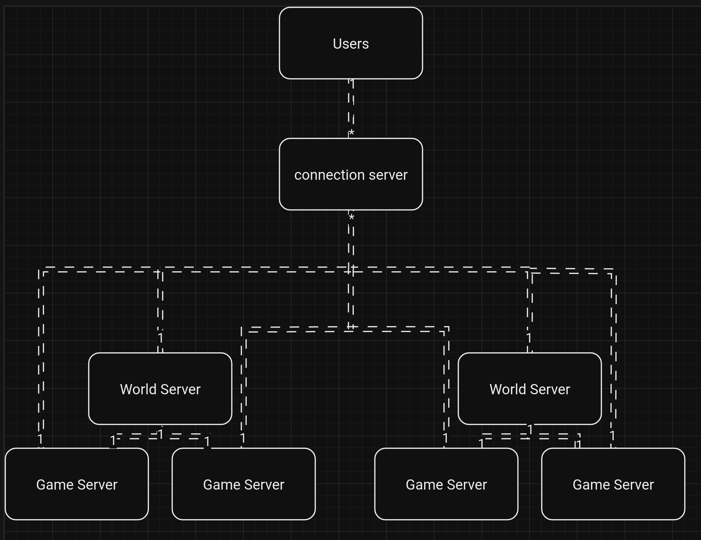

# Dwarf Wars

This will be a Dwarf fortress / Rimworld enspired Multiplayer game. I am hoping to make it have the same sandbox story driven feel as it's inspiration but with friends. or strangers, however you want to play.

## Game Scope

I want to have the world depth of Dwarf Fortress with it's 3D words and massive simulation but I want the actual game play and mechanics of how the world interacts with itself to be more simple like in Rimworld. I don't really want to spend the next 20 year coding the game up to be on par with the depth of Dwarf Fortress.

There should be two main components to the game.

- Client
- Server

### Backend

The backend is written in go and will relay on Sqlite3 files to store
information. I want this project to be easy to spin up on anyone's system. This
is supposed to be a self host game. I am not sure if there are any better
technologies out there that would allow for better saving of data then Sqlite3.

Need to figure out how to close a socket connection when the client sends a FIN
packet to the server. the problem is looking like some clients will send a
RESET connection request if they have data in their buffer or not.

The server will probably need to be broken up into multiple parts to not have the whole thing be quite so monolithic:

+ __Current__
  + Connection / Auth Server
  + World Server
  + Game Server
  + Databases
    + SQL Server
    + Redis Server
+ __Potential In Future__
   + Client / Lobby Server
      + Finding a server
      + Looking at stats
      + all none game related client actions
   + Broker Server
   + API Gateway
   + Connection Proxy / Server

From what I can find the difference is that the game server will handle the
individual games while a world server will manage a cluster of game servers.

Going to have a connection server that will the the sole connection point and authentication point for users. the server will pool user traffic and batch it to the appropriate game server /world server

#### World Server vs Game Server

The world server is the manager of each match that is happening across any children game servers that it has while the game server purely calculates and manages the games that it is assigned. that is the best explanation I have for now.

#### Secrets Storage

I am currently looking into docker secrets for storing usernames, passwords, tokens. I know that you can use AWS Secrets manager but I don't want to pay for a cloud service when I can host something locally. I have plenty of computing power. there is no reason to buy more from amazon.

#### Encoding & Decoding

I Have chosen to go with Golang Gobs for this projects because the server and
client are both planned to be in Go, I am not building a game that requires -1
latency. actually I am thinking of having the tick rate be half a second long
so there will be plenty of time for network messages to be encoded and decoded.
Gobs should make the process much easier and if they become a choke point in
the future then I will just refactor the code as I don't think the network
encoding / decoding will be super hard to swap out. all this should be doing
anyways is encoding/decoding and the passing the data structure on to the next
step.

#### Connections
Each Client should have 2 connecections to the game server. a TCP connection
for managing the meta data and will be more of a management conneciton and a
UDP connection that will handle all of the game data. I am still unsure about
this as I think that if I just pushed the game data through a TCP connection it
would be fine and much easier as I would just have to worry about processing
the data not if it gets to me properly or not. that can be handed off to the
NIC card and network drivers if we are using TCP.

Network buffers are an important topic to look into. this is kinda like youtube buffers but for games. 

There will need to be a lot of predictive code for where the client is and
where the server things everything should be. because this is Rimworld type
game where the player will not have direct control over units this should be
less touchy to implement...

### Frontend

The Front end will be written in Go as well as the backend. This is to enable
gobs as a serialization method. I was originally thinking that this could be a
web based game but not if we are using gobs. I think it would be for the best
to use a proper client anyways. Web games are not as popular as they used to be
and if I am using go to procuess the front end is shouldn't be all that hard to
make the client multiplatform anyways.
